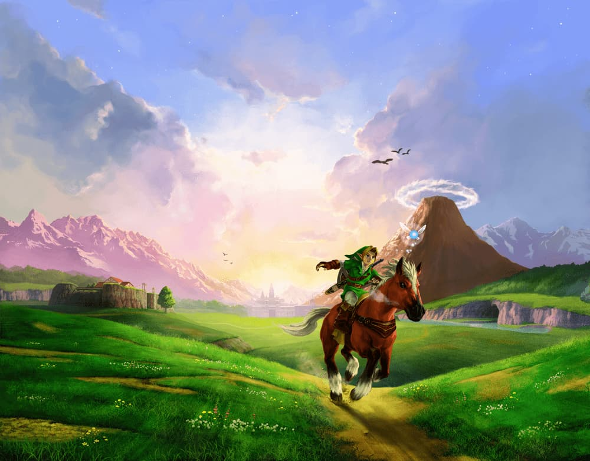

<h1 align="center">The Hyrule Field API</h1>



---

Esta una **API REST** sobre la saga **The Legend of Zelda**, creada para el cliente: **[zelda_wiki_CLIENT](https://github.com/nox456/zelda_wiki_CLIENT)** 

## Uso
Objeto **BASE** de respuesta:

```json
{
    "tableName": /* TEXT */,
    "query": {
        "field": /* TEXT */,
        "value": /* TEXT | UUID */
    },
    "data": /* ARRAY | OBJECT | NULL */
}
```

**Ejemplo:**

`GET` - `/games/name/ocarina`

```json
{
    "tableName": /* TEXT */,
    "query": {
        "field": /* TEXT */,
        "value": /* TEXT | UUID */
    },
    "data": [
        {
            "id": "1ea680ad-a109-4317-aaa8-cb563d29fa88",
            "name": "The Legend of Zelda - Ocarina of Time",
            "console_id": "be961300-529a-492f-b2dd-6e5deff974ea",
            "release_date": "1998-11-23T04:00:00.000Z",
            "description": "The Legend of Zelda: Ocarina of Time (ぜるだ の でんせつ とき の おかりな, Zeruda no Densetsu Toki no Okarina) es la...",
            "img": "games/ocarina.webp"
        }
    ]
}
```


### Recursos

- **[Personajes](#personajes)**
- **[Juegos](#juegos)**
- **[Consolas]**
- **[Razas]**
- **[Enemigos]**

---

### Personajes

Esquema Básico:
```json
{
    "id": /* UUID */,
    "name": /* TEXT */,
    "race_id": /* UUID */,
    "games_id": /* UUID[] */,
    "description": /* TEXT */,
    "img": /* TEXT */
}
```

Endopoints:

- `GET` - `/characters/` : Obtener todos los personajes

    <details>
    <summary><strong>Ejemplo:</strong></summary>

    ```json
    [
        {
            "id": "e7e41475-9575-49eb-bd0b-a685c7fc1bef",
            "name": "Gran Hada del Poder",
            "race_id": "673ef7c5-2d5d-46a7-a4ec-6696d2021590",
            "games_id": [
                "1ea680ad-a109-4317-aaa8-cb563d29fa88",
                "27d7e693-27ad-4bc3-88f6-ed9a29e9ff84"
            ],
            "description": "La Gran Hada del Poder (Great Fairy of Power en inglés) es un personaje recurrente ...",
            "img": "characters/gran_hada_del_poder.webp"
        },
        {
            "id": "51a2e739-7a21-40c4-be01-8b0903bbc12b",
            "name": "Link",
            "race_id": "de305a29-5e5b-40b1-bbca-59479b9b6f74",
            "games_id": [
                "54c0e405-69dc-4a19-b731-df697bbfad0f",
                "1976757b-405b-4d29-b592-086cb6857ea6",
                ...
            ],
            "description": "Link (リンク, Rinku) es el nombre del protagonista de The Legend of Zelda. Es el Héroe Elegido por...",
            "img": "characters/link.webp"
        },
        ...
    ]
    ```
</details>

- `GET` - `/characters/{id}` : Obtener **un personaje** por ID

    <details>
    <summary><strong>Ejemplo:</strong></summary>

    `/characters/51a2e739-7a21-40c4-be01-8b0903bbc12b`

    ```json
    {
        "id": "51a2e739-7a21-40c4-be01-8b0903bbc12b",
        "name": "Link",
        "race_id": "de305a29-5e5b-40b1-bbca-59479b9b6f74",
        "games_id": [
            "54c0e405-69dc-4a19-b731-df697bbfad0f",
            "1976757b-405b-4d29-b592-086cb6857ea6",
            ...
        ],
        "description": "Link (リンク, Rinku) es el nombre del protagonista de The Legend of Zelda. Es el ...",
            "img": "characters/link.webp" 
    }
    ```
        
</details>


- `GET` - `/characters/name/{name}` : Obtener **varios personajes** por nombre

    <details>
        <summary><strong>Ejemplo:</strong></summary>

    `/characters/name/gano`

    ```json
    [
        {
            "id": "abc85f0d-5150-4fdf-b780-d4f5c88d6012",
            "name": "Ganon",
            "race_id": "7d1bcc39-3511-4e57-aac7-25d3776ed647",
            "games_id": [
                "54c0e405-69dc-4a19-b731-df697bbfad0f",
                "1976757b-405b-4d29-b592-086cb6857ea6",
                ...
            ],
            "description": "Ganon (ガノン, Ganon), es la forma alternativa de Ganondorf. Conocido como el ...",
            "img": "characters/ganon.webp"
        },
        {
            "id": "b1895c1e-6aab-474d-969f-31940b9af9d7",
            "name": "Ganondorf",
            "race_id": "24738b5a-5f15-4d23-9ed4-911547b65e7e",
            "games_id": [
                "1ea680ad-a109-4317-aaa8-cb563d29fa88",
                "30920bf4-0dd8-4829-a0e7-53c0eda0045b",
                ...
            ],
            "description": "Ganondorf (ガノンドロフ, Ganondorofu) también conocido como el Rey Demonio o Señor de la Oscuridad, ...",
            "img": "characters/ganondorf.webp"
        }
    ]
    ```
</details>

- `GET` - `/characters/game/{gameID}` : Obtener **varios personajes** por juego

    <details>
        <summary><strong>Ejemplo:</strong></summary>

    `/characters/game/54c0e405-69dc-4a19-b731-df697bbfad0f`
    
    ```json
    [
        {
            "id": "51a2e739-7a21-40c4-be01-8b0903bbc12b",
            "name": "Link",
            "race_id": "de305a29-5e5b-40b1-bbca-59479b9b6f74",
            "games_id": [
                "54c0e405-69dc-4a19-b731-df697bbfad0f",
                "1976757b-405b-4d29-b592-086cb6857ea6",
                ...
            ],
            "description": "Link (リンク, Rinku) es el nombre del protagonista de The Legend of Zelda...",
            "img": "characters/link.webp"
        },
        {
            "id": "10680ab0-de12-464e-91cd-ccaf6c0cdcad",
            "name": "Zelda",
            "race_id": "de305a29-5e5b-40b1-bbca-59479b9b6f74",
            "games_id": [
                "54c0e405-69dc-4a19-b731-df697bbfad0f",
                "1976757b-405b-4d29-b592-086cb6857ea6",
                ...
            ],
            "description": "La Princesa Zelda (ゼルダ姫, Zeruda-hime) es un personaje...",
            "img": "characters/zelda.webp"
        }
    ]
    ```

</details>

- `GET` - `/characters/race/{raceID}` : Obtener **varios personajes** por raza

    <details>
        <summary><strong>Ejemplo:</strong></summary>

    `/characters/race/de305a29-5e5b-40b1-bbca-59479b9b6f74`

    ```json
    [
        {
            "id": "51a2e739-7a21-40c4-be01-8b0903bbc12b",
            "name": "Link",
            "race_id": "de305a29-5e5b-40b1-bbca-59479b9b6f74",
            "games_id": [
                "54c0e405-69dc-4a19-b731-df697bbfad0f",
                "1976757b-405b-4d29-b592-086cb6857ea6",
                ...
            ],
            "description": "Link (リンク, Rinku) es el nombre del protagonista de The Legend of Zelda...",
            "img": "characters/link.webp"
        },
        {
            "id": "10680ab0-de12-464e-91cd-ccaf6c0cdcad",
            "name": "Zelda",
            "race_id": "de305a29-5e5b-40b1-bbca-59479b9b6f74",
            "games_id": [
                "54c0e405-69dc-4a19-b731-df697bbfad0f",
                "1976757b-405b-4d29-b592-086cb6857ea6",
                ...
            ],
            "description": "La Princesa Zelda (ゼルダ姫, Zeruda-hime) es un personaje...",
            "img": "characters/zelda.webp"
        }
    ]
    ```
</details>

---

### Juegos

Esquema Básico:

```json
{
    "id": /* UUID */,
    "name": /* TEXT */,
    "console_id": /* UUID */,
    "release_date": /* DATE */,
    "description": /* TEXT */,
    "img": /* TEXT */
}
```

Endopoints:

- `GET` - `/games/` : Obtener todos los juegos

    <details>
    <summary><strong>Ejemplo:</strong></summary>

    ```json
    [
        {
            "id": "54c0e405-69dc-4a19-b731-df697bbfad0f",
            "name": "The Legend of Zelda",
            "console_id": "7a2d73e2-02e2-484e-9e87-514009e289b3",
            "release_date": "1987-08-22T04:00:00.000Z",
            "description": "The Legend of Zelda (ゼルダの伝説, Zeruda no Densetsu), también conocido como...",
            "img": "games/zelda1.webp"
        },
        {
            "id": "1976757b-405b-4d29-b592-086cb6857ea6",
            "name": "Zelda II - The Adventure of Link",
            "console_id": "7a2d73e2-02e2-484e-9e87-514009e289b3",
            "release_date": "1988-12-01T04:00:00.000Z",
            "description": "Zelda II: The Adventure of Link (リンクの冒険, Rinku no Bōken), es la segunda...",
            "img": "games/zelda2.webp"
        },
        ...
    ]
    ```

</details>

- `GET` - `/games/{id}` : Obtener **un juego** por ID

    <details>
    <summary><strong>Ejemplo:</strong></summary>

    `/games/1ea680ad-a109-4317-aaa8-cb563d29fa88`    

    ```json
    {
        "id": "1ea680ad-a109-4317-aaa8-cb563d29fa88",
        "name": "The Legend of Zelda - Ocarina of Time",
        "console_id": "be961300-529a-492f-b2dd-6e5deff974ea",
        "release_date": "1998-11-23T04:00:00.000Z",
        "description": "The Legend of Zelda: Ocarina of Time (ぜるだ の でんせつ とき の おかりな, Zeruda no Densetsu Toki no Okarina) es la quinta entrega de saga...",
        "img": "games/ocarina.webp"
    }
    ```

</details>

- `GET` - `/games/name/{name}` : Obtener **varios juegos** por nombre
