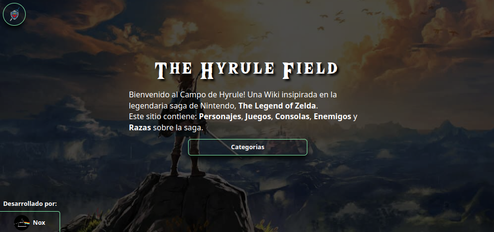

<h1 align="center">The Hyrule Field API</h1>



---

Esta una **API REST** sobre la saga **The Legend of Zelda**, creada para el cliente: **[zelda_wiki_CLIENT](https://github.com/nox456/zelda_wiki_CLIENT)** 
## Uso
Objeto **BASE** de respuesta:

```json
{
    "tableName": "TEXT",
    "query": {
        "field": "TEXT",
        "value": "TEXT | NULL"
    },
    "data": "OBJECT | ARRAY | NULL"
}
```

**Ejemplo:**

`GET` - `/games/name/ocarina`

```json
{
    "tableName": "games",
    "query": {
        "field": "name",
        "value": "ocarina"
    },
    "data": [
        {
            "id": "1ea680ad-a109-4317-aaa8-cb563d29fa88",
            "name": "The Legend of Zelda - Ocarina of Time",
            "console_id": "be961300-529a-492f-b2dd-6e5deff974ea",
            "release_date": "1998-11-23T04:00:00.000Z",
            "description": "The Legend of Zelda: Ocarina of Time (ぜるだ の でんせつ とき の おかりな, Zeruda no Densetsu Toki no Okarina) es la...",
            "img": "games/ocarina.webp"
        }
    ]
}
```


### Recursos

- **[Personajes](#personajes)**
- **[Juegos](#juegos)**
- **[Consolas](#consolas)**
- **[Razas](#razas)**
- **[Enemigos](#enemigos)**

---

### Personajes

Esquema Básico:
```json
{
    "id": "UUID",
    "name": "TEXT",
    "race_id": "UUID",
    "games_id": "UUID[]",
    "description": "TEXT",
    "img": "TEXT"
}
```

Endpoints:

- `GET` - `/characters/` : Obtener **todos los personajes**

    <details>
    <summary><strong>Ejemplo:</strong></summary>

    ```json
    [
        {
            "id": "e7e41475-9575-49eb-bd0b-a685c7fc1bef",
            "name": "Gran Hada del Poder",
            "race_id": "673ef7c5-2d5d-46a7-a4ec-6696d2021590",
            "games_id": [
                "1ea680ad-a109-4317-aaa8-cb563d29fa88",
                "27d7e693-27ad-4bc3-88f6-ed9a29e9ff84"
            ],
            "description": "La Gran Hada del Poder (Great Fairy of Power en inglés) es un personaje recurrente ...",
            "img": "characters/gran_hada_del_poder.webp"
        },
        {
            "id": "51a2e739-7a21-40c4-be01-8b0903bbc12b",
            "name": "Link",
            "race_id": "de305a29-5e5b-40b1-bbca-59479b9b6f74",
            "games_id": [
                "54c0e405-69dc-4a19-b731-df697bbfad0f",
                "1976757b-405b-4d29-b592-086cb6857ea6",
                ...
            ],
            "description": "Link (リンク, Rinku) es el nombre del protagonista de The Legend of Zelda. Es el Héroe Elegido por...",
            "img": "characters/link.webp"
        },
        ...
    ]
    ```
</details>

- `GET` - `/characters/{id}` : Obtener **un personaje** por ID

    <details>
    <summary><strong>Ejemplo:</strong></summary>

    `/characters/51a2e739-7a21-40c4-be01-8b0903bbc12b`

    ```json
    {
        "id": "51a2e739-7a21-40c4-be01-8b0903bbc12b",
        "name": "Link",
        "race_id": "de305a29-5e5b-40b1-bbca-59479b9b6f74",
        "games_id": [
            "54c0e405-69dc-4a19-b731-df697bbfad0f",
            "1976757b-405b-4d29-b592-086cb6857ea6",
            ...
        ],
        "description": "Link (リンク, Rinku) es el nombre del protagonista de The Legend of Zelda. Es el ...",
        "img": "characters/link.webp" 
    }
    ``` 
</details>


- `GET` - `/characters/name/{name}` : Obtener **varios personajes** por nombre

    <details>
        <summary><strong>Ejemplo:</strong></summary>

    `/characters/name/gano`

    ```json
    [
        {
            "id": "abc85f0d-5150-4fdf-b780-d4f5c88d6012",
            "name": "Ganon",
            "race_id": "7d1bcc39-3511-4e57-aac7-25d3776ed647",
            "games_id": [
                "54c0e405-69dc-4a19-b731-df697bbfad0f",
                "1976757b-405b-4d29-b592-086cb6857ea6",
                "..."
            ],
            "description": "Ganon (ガノン, Ganon), es la forma alternativa de Ganondorf. Conocido como el ...",
            "img": "characters/ganon.webp"
        },
        {
            "id": "b1895c1e-6aab-474d-969f-31940b9af9d7",
            "name": "Ganondorf",
            "race_id": "24738b5a-5f15-4d23-9ed4-911547b65e7e",
            "games_id": [
                "1ea680ad-a109-4317-aaa8-cb563d29fa88",
                "30920bf4-0dd8-4829-a0e7-53c0eda0045b",
                "..."
            ],
            "description": "Ganondorf (ガノンドロフ, Ganondorofu) también conocido como el Rey Demonio o Señor de la Oscuridad, ...",
            "img": "characters/ganondorf.webp"
        }
    ]
    ```
</details>

- `GET` - `/characters/game/id/{gameID}` : Obtener **varios personajes** por el ID del juego

    <details>
        <summary><strong>Ejemplo:</strong></summary>

    `/characters/game/54c0e405-69dc-4a19-b731-df697bbfad0f`
    
    ```json
    [
        {
            "id": "51a2e739-7a21-40c4-be01-8b0903bbc12b",
            "name": "Link",
            "race_id": "de305a29-5e5b-40b1-bbca-59479b9b6f74",
            "games_id": [
                "54c0e405-69dc-4a19-b731-df697bbfad0f",
                "1976757b-405b-4d29-b592-086cb6857ea6",
                "..."
            ],
            "description": "Link (リンク, Rinku) es el nombre del protagonista de The Legend of Zelda...",
            "img": "characters/link.webp"
        },
        {
            "id": "10680ab0-de12-464e-91cd-ccaf6c0cdcad",
            "name": "Zelda",
            "race_id": "de305a29-5e5b-40b1-bbca-59479b9b6f74",
            "games_id": [
                "54c0e405-69dc-4a19-b731-df697bbfad0f",
                "1976757b-405b-4d29-b592-086cb6857ea6",
                "..."
            ],
            "description": "La Princesa Zelda (ゼルダ姫, Zeruda-hime) es un personaje...",
            "img": "characters/zelda.webp"
        }
    ]
    ```
</details>

- `GET` - `/characters/game/name/{gameName}` : Obtener **varios personajes** por el nombre del juego

    <details>
        <summary><strong>Ejemplo:</strong></summary>

    `/characters/game/name/ocarina`

    ```json
    [
        {
            "id": "7045ba71-2a54-43e3-b92e-5a168d757ac5",
            "name": "Link",
            "race_id": "4132dca7-51b8-47db-bef5-e98f58b847f0",
            "games_id": [
                "14067b61-674c-4af6-b912-26dccad10f35",
                "ad5531ba-e288-4375-b740-58857e6ebd57",
                "..."
            ],
            "description": "Link (リンク, Rinku) es el nombre del protagonista de The Legend of Zelda. Es el Héroe Elegido por las...",
            "img": "characters/link.webp"
        },
        {
            "id": "a60b3b3f-2584-4bb3-a2d7-c882f075aa46",
            "name": "Ganon",
            "race_id": "03e8a1d5-eb7e-4ca7-a2f0-7495eec84106",
            "games_id": [
                "14067b61-674c-4af6-b912-26dccad10f35",
                "ad5531ba-e288-4375-b740-58857e6ebd57",
                "..."
            ],
            "description": "Ganon (ガノン, Ganon), es la forma alternativa de Ganondorf. Conocido como el Rey del Mal, es el...",
            "img": "characters/ganon.webp"
        },
        "..."
    ]
    ```
</details>

- `GET` - `/characters/race/id/{raceID}` : Obtener **varios personajes** por el ID de la raza

    <details>
        <summary><strong>Ejemplo:</strong></summary>

    `/characters/race/de305a29-5e5b-40b1-bbca-59479b9b6f74`

    ```json
    [
        {
            "id": "51a2e739-7a21-40c4-be01-8b0903bbc12b",
            "name": "Link",
            "race_id": "de305a29-5e5b-40b1-bbca-59479b9b6f74",
            "games_id": [
                "54c0e405-69dc-4a19-b731-df697bbfad0f",
                "1976757b-405b-4d29-b592-086cb6857ea6",
                "..."
            ],
            "description": "Link (リンク, Rinku) es el nombre del protagonista de The Legend of Zelda...",
            "img": "characters/link.webp"
        },
        {
            "id": "10680ab0-de12-464e-91cd-ccaf6c0cdcad",
            "name": "Zelda",
            "race_id": "de305a29-5e5b-40b1-bbca-59479b9b6f74",
            "games_id": [
                "54c0e405-69dc-4a19-b731-df697bbfad0f",
                "1976757b-405b-4d29-b592-086cb6857ea6",
                "..."
            ],
            "description": "La Princesa Zelda (ゼルダ姫, Zeruda-hime) es un personaje...",
            "img": "characters/zelda.webp"
        }
    ]
    ```
</details>

- `GET` - `/characters/race/name/{raceName}` : Obtener **varios personajes** por el nombre de la raza

    <details>
        <summary><strong>Ejemplo:</strong></summary>

    `/characters/race/name/hylian`

    ```json
    [
        {
            "id": "7045ba71-2a54-43e3-b92e-5a168d757ac5",
            "name": "Link",
            "race_id": "4132dca7-51b8-47db-bef5-e98f58b847f0",
            "games_id": [
                "14067b61-674c-4af6-b912-26dccad10f35",
                "ad5531ba-e288-4375-b740-58857e6ebd57",
                "..."
            ],
            "description": "Link (リンク, Rinku) es el nombre del protagonista de The Legend of Zelda. Es el Héroe Elegido por las Diosas...",
            "img": "characters/link.webp"
        },
        {
            "id": "f7b5dac0-fb89-4455-ab09-2b9e8efdb68b",
            "name": "Zelda",
            "race_id": "4132dca7-51b8-47db-bef5-e98f58b847f0",
            "games_id": [
                "14067b61-674c-4af6-b912-26dccad10f35",
                "ad5531ba-e288-4375-b740-58857e6ebd57",
                "..."
            ],
            "description": "La Princesa Zelda (ゼルダ姫, Zeruda-hime) es un personaje principal de la saga de...",
            "img": "characters/zelda.webp"
        },
        {
            "id": "63442562-0672-4f33-b054-9477cf53cddb",
            "name": "Marín",
            "race_id": "4132dca7-51b8-47db-bef5-e98f58b847f0",
            "games_id": [
                "e9d4035d-a8a4-47ca-82d8-bb907855b69a"
            ],
            "description": "Marín (マリン, Marin) es un personaje de The Legend of Zelda: Links Awakening...",
            "img": "characters/marin.webp"
        }
    ]
    ```
</details>

---

### Juegos

Esquema Básico:

```json
{
    "id": "UUID",
    "name": "TEXT",
    "console_id": "UUID",
    "release_date": "DATE",
    "description": "TEXT",
    "img": "TEXT"
}
```

Endpoints:

- `GET` - `/games/` : Obtener **todos los juegos**

    <details>
    <summary><strong>Ejemplo:</strong></summary>

    ```json
    [
        {
            "id": "54c0e405-69dc-4a19-b731-df697bbfad0f",
            "name": "The Legend of Zelda",
            "console_id": "7a2d73e2-02e2-484e-9e87-514009e289b3",
            "release_date": "1987-08-22T04:00:00.000Z",
            "description": "The Legend of Zelda (ゼルダの伝説, Zeruda no Densetsu), también conocido como...",
            "img": "games/zelda1.webp"
        },
        {
            "id": "1976757b-405b-4d29-b592-086cb6857ea6",
            "name": "Zelda II - The Adventure of Link",
            "console_id": "7a2d73e2-02e2-484e-9e87-514009e289b3",
            "release_date": "1988-12-01T04:00:00.000Z",
            "description": "Zelda II: The Adventure of Link (リンクの冒険, Rinku no Bōken), es la segunda...",
            "img": "games/zelda2.webp"
        },
        "..."
    ]
    ```
</details>

- `GET` - `/games/{id}` : Obtener **un juego** por ID

    <details>
    <summary><strong>Ejemplo:</strong></summary>

    `/games/1ea680ad-a109-4317-aaa8-cb563d29fa88`    

    ```json
    {
        "id": "1ea680ad-a109-4317-aaa8-cb563d29fa88",
        "name": "The Legend of Zelda - Ocarina of Time",
        "console_id": "be961300-529a-492f-b2dd-6e5deff974ea",
        "release_date": "1998-11-23T04:00:00.000Z",
        "description": "The Legend of Zelda: Ocarina of Time (ぜるだ の でんせつ とき の おかりな, Zeruda no Densetsu Toki no Okarina) es la quinta entrega de saga...",
        "img": "games/ocarina.webp"
    }
    ```
</details>

- `GET` - `/games/name/{name}` : Obtener **varios juegos** por nombre

    <details>
    <summary><strong>Ejemplo:</strong></summary>

    `/games/name/ocarina`

    ```json
    [
        {
            "id": "1ea680ad-a109-4317-aaa8-cb563d29fa88",
            "name": "The Legend of Zelda - Ocarina of Time",
            "console_id": "be961300-529a-492f-b2dd-6e5deff974ea",
            "release_date": "1998-11-23T04:00:00.000Z",
            "description": "The Legend of Zelda: Ocarina of Time (ぜるだ の でんせつ とき の おかりな, Zeruda no Densetsu Toki no Okarina) es la...",
            "img": "games/ocarina.webp"
        }
    ]
    ```
</details>

- `GET` - `/games/console/id/{consoleID}` : Obtener **varios juegos** por el ID de la consola

    <details>
    <summary><strong>Ejemplo:</strong></summary>

    `/games/console/4e0b9ba2-8c26-4fea-b187-0657eb98b2fd`

    ```json
    [
        {
            "id": "bf7bd1ae-a6d8-4438-a41b-b3ed0294ed92",
            "name": "The Legend of Zelda - Breath of the Wild",
            "console_id": "4e0b9ba2-8c26-4fea-b187-0657eb98b2fd",
            "release_date": "2017-03-03T04:00:00.000Z",
            "description": "The Legend of Zelda: Breath of the Wild ((ゼルダの伝説 ブレス オブ ザ ワイルド, Zeruda no Densetsu: Buresu obu za Wairudo en japonés)) es el...",
            "img": "games/breath_of_the_wild.webp"
        },
        {
            "id": "526acc74-fa42-4b70-83ae-a44a9dc60bc7",
            "name": "The Legend of Zelda - Tears of the Kingdom",
            "console_id": "4e0b9ba2-8c26-4fea-b187-0657eb98b2fd",
            "release_date": "2023-05-12T04:00:00.000Z",
            "description": "The Legend of Zelda: Tears of the Kingdom (ゼルダの伝説 ティアーズ オブ ザ キングダム, Zeruda no Densetsu Tiāzu obu za Kingudamu)...",
            "img": "games/tears_of_the_kingdom.webp"
        }
    ]
    ```
</details>

- `GET` - `/games/console/name/{consoleName}` : Obtener **varios** juegos por el nombre de la consola

    <details>
        <summary><strong>Ejemplo:</strong></summary>

    `/games/console/name/64`

    ```json
    [
        {
            "id": "b070b116-d299-4de0-8bf3-c0fc9f4eda63",
            "name": "The Legend of Zelda - Ocarina of Time",
            "console_id": "31ac1827-234d-4e87-8b77-7b31461e01a8",
            "release_date": "1998-11-23T04:00:00.000Z",
            "description": "The Legend of Zelda: Ocarina of Time (ぜるだ の でんせつ とき の おかりな, Zeruda no Densetsu Toki no Okarina) es la quinta entrega de saga The Legend of Zelda, desarrollado por...",
            "img": "games/ocarina.webp"
        },
        {
            "id": "03d68c62-c231-4e52-adcb-171953807bd9",
            "name": "The Legend of Zelda - Majoras Mask",
            "console_id": "31ac1827-234d-4e87-8b77-7b31461e01a8",
            "release_date": "2000-10-26T04:00:00.000Z",
            "description": "The Legend of Zelda: Majoras Mask (ゼルダの伝説 ムジュラの仮面, Zeruda no Densetsu: Mujura no Kamen ?) es la sexta entrega de...",
            "img": "games/majoras.webp"
        }
    ]
    ```
</details>

---

### Consolas

Esquema Básico:

```json
{
    "id": "UUID",
    "name": "TEXT",
    "release_date": "DATE",
    "games_id": "UUID[]",
    "img": "TEXT"
}
```

Endpoints:

- `GET` - `/consoles/` : Obtener **todas las consolas**

    <details>
    <summary><strong>Ejemplo:</strong></summary>

    ```json
    [
        {
            "id": "0bf87ff7-3739-4323-b330-918d3b402498",
            "name": "Nintendo Entertainment System (NES)",
            "release_date": "1985-11-18T04:00:00.000Z",
            "games_id": [
                "a49ca111-cfe1-43a5-bdc7-046df9fbfb00",
                "6a25c091-cd12-46e0-9a72-a65f2aa39458"
            ],
            "img": "consoles/nes.webp"
        },
        {
            "id": "c8b06553-194a-4ef3-ac9e-8e983595bce0",
            "name": "Super Nintendo Entertainment System (SNES)",
            "release_date": "1991-08-13T04:00:00.000Z",
            "games_id": [
                "c1847bab-a0d9-4e90-b92c-03e18bcf3f54"
            ],
            "img": "consoles/snes.webp"
        }
    ]
    ```
</details>

- `GET` - `/consoles/{id}` : Obtener **una consola** por ID

    <details>
    <summary><strong>Ejemplo:</strong></summary>

    `/consoles/3c87a279-d9b6-478b-92d3-50cb5ea3165b`

    ```json
    {
        "id": "3c87a279-d9b6-478b-92d3-50cb5ea3165b",
        "name": "Nintendo GameCube",
        "release_date": "2001-11-18T04:00:00.000Z",
        "games_id": [
            "ece9d029-876b-4d1c-b0e7-54e835756684",
            "25578af4-b2ac-4d2e-811b-60237b94d360",
            "66e809ea-cfbd-4f4f-92bf-dabf9979ff63"
        ],
        "img": "consoles/gamecube.webp"
    }
    ```
</details>

- `GET` - `/consoles/game/{gameID}` : Obtener **una consola** por el ID del juego

    <details>
    <summary><strong>Ejemplo:</strong></summary>

    `/consoles/game/c1847bab-a0d9-4e90-b92c-03e18bcf3f54`

    ```json
    {
        "id": "c8b06553-194a-4ef3-ac9e-8e983595bce0",
        "name": "Super Nintendo Entertainment System (SNES)",
        "release_date": "1991-08-13T04:00:00.000Z",
        "games_id": [
            "c1847bab-a0d9-4e90-b92c-03e18bcf3f54"
        ],
        "img": "consoles/snes.webp"
    }
    ```
</details>

---

### Razas

Esquema Básico:

```json
{
    "id": "UUID",
    "name": "TEXT",
    "games_id": "UUID[]",
    "description": "TEXT",
    "img": "TEXT"
}
```

Endpoints:

- `GET` - `/races/` - Obtener **todas las razas**

    <details>
    <summary><strong>Ejemplo:</strong></summary>

    ```json
    [
        {
            "id": "de305a29-5e5b-40b1-bbca-59479b9b6f74",
            "name": "Hyliano",
            "games_id": [
                "54c0e405-69dc-4a19-b731-df697bbfad0f",
                "1976757b-405b-4d29-b592-086cb6857ea6",
                "..."
            ],
            "description": "Los Hylianos (ハイリア族, Hairia-zoku), también conocidos como los Hylians, son una...",
            "img": "races/hyliano.webp"
        },
        {
            "id": "a31ce347-5d14-4e4b-aea4-b60e83ae04b7",
            "name": "Kokiri",
            "games_id": [
                "1ea680ad-a109-4317-aaa8-cb563d29fa88",
                "30920bf4-0dd8-4829-a0e7-53c0eda0045b"
            ],
            "description": "Los Kokiri (コキリ, Kokiri), son una raza que habita aparece en Ocarina of Time y en The Wind Waker. Ellos habitan en el...",
            "img": "races/kokiri.webp"
        },
        "..."
    ]
    ```
</details>

- `GET` - `/races/{id}` : Obtener **una raza** por id

    <details>
    <summary><strong>Ejemplo:</strong></summary>

    `/races/40535a79-fd0c-4077-89f4-723ee8cc0fca`

    ```json
    {
        "id": "40535a79-fd0c-4077-89f4-723ee8cc0fca",
        "name": "Hada",
        "games_id": [
            "a49ca111-cfe1-43a5-bdc7-046df9fbfb00",
            "6a25c091-cd12-46e0-9a72-a65f2aa39458",
            "..."
        ],
        "description": "Las Hadas (妖精, Yōsei) constituyen un elemento habitual en la saga The Legend of Zelda. Son un tipo de...",
        "img": "races/hada.webp"
    }
    ```
</details>

- `GET` - `/races/name/{name}` : Obtener **varias razas** por nombre
    
    <details>
    <summary><strong>Ejemplo:</strong></summary>

    `/races/name/hylia` 

    ```json
    [
        {
            "id": "de305a29-5e5b-40b1-bbca-59479b9b6f74",
            "name": "Hyliano",
            "games_id": [
                "54c0e405-69dc-4a19-b731-df697bbfad0f",
                "1976757b-405b-4d29-b592-086cb6857ea6",
                "..."
            ],
            "description": "Los Hylianos (ハイリア族, Hairia-zoku), también conocidos como los Hylians...",
            "img": "races/hyliano.webp"
        }
    ]
    ```
</details>

- `GET` - `/races/game/id/{gameID}` : Obtener **varias razas** por ID del juego

    <details>
    <summary><strong>Ejemplo:</strong></summary>

    `/races/game/a49ca111-cfe1-43a5-bdc7-046df9fbfb00`

    ```json
    [
        {
            "id": "4afc7454-2be2-44b3-8f91-6c93c20bd82d",
            "name": "Hyliano",
            "games_id": [
                "a49ca111-cfe1-43a5-bdc7-046df9fbfb00",
                "6a25c091-cd12-46e0-9a72-a65f2aa39458",
                "..."
            ],
            "description": "Los Hylianos (ハイリア族, Hairia-zoku), también conocidos como los Hylians, son una raza de...",
            "img": "races/hyliano.webp"
        },
        {
            "id": "40535a79-fd0c-4077-89f4-723ee8cc0fca",
            "name": "Hada",
            "games_id": [
                "a49ca111-cfe1-43a5-bdc7-046df9fbfb00",
                "6a25c091-cd12-46e0-9a72-a65f2aa39458",
                "..."
            ],
            "description": "Las Hadas (妖精, Yōsei) constituyen un elemento habitual en la saga The Legend of Zelda. Son un tipo de...",
            "img": "races/hada.webp"
        }
    ]
    ```
</details>

- `GET` - `/races/game/name/{gameName}` : Obtener **varias razas** por el nombre del juego

    <details>
        <summary><strong>Ejemplo:</strong></summary>

    `/races/game/name/twilight`

    ```json
    [
        {
            "id": "4132dca7-51b8-47db-bef5-e98f58b847f0",
            "name": "Hyliano",
            "games_id": [
                "14067b61-674c-4af6-b912-26dccad10f35",
                "ad5531ba-e288-4375-b740-58857e6ebd57",
                "..."
            ],
            "description": "Los Hylianos (ハイリア族, Hairia-zoku), también conocidos como los Hylians, son...",
            "img": "races/hyliano.webp"
        },
        {
            "id": "4efc41b3-a6cd-44c1-8bcf-b56c657f87d9",
            "name": "Gerudo",
            "games_id": [
                "b070b116-d299-4de0-8bf3-c0fc9f4eda63",
                "03d68c62-c231-4e52-adcb-171953807bd9",
                "..."
            ],
            "description": "Las Gerudo son unas de las razas recurrentes de la saga de The Legend of Zelda. Son una...",
            "img": "races/gerudo.webp"
        }
    ]
    ```
</details>

---

### Enemigos

Esquema Básico:

```json
{
    "id": "UUID",
    "name": "TEXT",
    "category": "TEXT",
    "games_id": "UUID[]",
    "img": "TEXT"
}
```

Endpoints:

- `GET` - `/enemies/` : Obtener **todos los enemigos**

    <details>
    <summary><strong>Ejemplo:</strong></summary>

    ```json
    [
        {
            "id": "d0f63188-9684-4d2f-9b0a-a1615e2d7c34",
            "name": "Octorok",
            "category": "Basico",
            "games_id": [
                "54c0e405-69dc-4a19-b731-df697bbfad0f",
                "1976757b-405b-4d29-b592-086cb6857ea6",
                "..."
            ],
            "img": "enemies/octorok.webp"
        },
        {
            "id": "c02c53fc-e932-4aff-b048-d0eac088e6af",
            "name": "Leever",
            "category": "Basico",
            "games_id": [
                "54c0e405-69dc-4a19-b731-df697bbfad0f",
                "1976757b-405b-4d29-b592-086cb6857ea6",
                "..."
            ],
            "img": "enemies/leever.webp"
        }
        "..."
    ]
    ```
</details>

- `GET` - `/enemies/name/{name}` : Obtener **varios enemigos** por nombre

    <details>
    <summary><strong>Ejemplo:</strong></summary>

    `/enemies/name/stalfo`

    ```json
    [
        {
            "id": "4f7b5568-57e2-4699-87e3-38b4e6794558",
            "name": "Stalfos",
            "category": "Basico",
            "games_id": [
                "54c0e405-69dc-4a19-b731-df697bbfad0f",
                "1976757b-405b-4d29-b592-086cb6857ea6",
                "..."
            ],
            "img": "enemies/stalfos.webp"
        }
    ]
    ```
</details>

- `GET` - `/enemies/{id}` : Obtener **un enemigo** por id

    <details>
    <summary><strong>Ejemplo:</strong></summary>

    `/enemies/2de6e55b-38be-45bd-84c6-2ff2523c2867`

    ```json
    {
        "id": "2de6e55b-38be-45bd-84c6-2ff2523c2867",
        "name": "Moblin",
        "category": "Basico",
        "games_id": [
            "54c0e405-69dc-4a19-b731-df697bbfad0f",
            "1976757b-405b-4d29-b592-086cb6857ea6",
            "..."
        ],
        "img": "enemies/moblin.webp"
    }
    ```
</details>

- `GET` - `/enemies/game/id/{gameID}` : Obtener **varios enemigos** por el ID del juego

    <details>
    <summary><strong>Ejemplo:</strong></summary>

    `/enemies/game/a49ca111-cfe1-43a5-bdc7-046df9fbfb00`

    ```json
    [
        {
            "id": "1067a89f-6d64-4a3e-8300-839a1132bdb0",
            "name": "Stalfos",
            "category": "Basico",
            "games_id": [
                "a49ca111-cfe1-43a5-bdc7-046df9fbfb00",
                "6a25c091-cd12-46e0-9a72-a65f2aa39458",
                "..."
            ],
            "img": "enemies/stalfos.webp"
        },
        {
            "id": "1d43769a-78e2-4a2c-9568-2fff36f1f2d1",
            "name": "Gibdo",
            "category": "Basico",
            "games_id": [
                "a49ca111-cfe1-43a5-bdc7-046df9fbfb00",
                "c1847bab-a0d9-4e90-b92c-03e18bcf3f54",
                "..."
            ],
            "img": "enemies/gibdo.webp"
        },
        "..."
    ]
    ```
</details>

- `GET` - `/enemies/game/name/{gameName}`: Obtener **varios enemigos** por el nombre del juego

    <details>
        <summary><strong>Ejemplo:</strong></summary>

    `/enemies/game/name/majoras`

    ```json
    [
        {
            "id": "d4a3bc22-e7c5-4d66-81a2-8944bbeff2a2",
            "name": "Octorok",
            "category": "Basico",
            "games_id": [
                "14067b61-674c-4af6-b912-26dccad10f35",
                "ad5531ba-e288-4375-b740-58857e6ebd57",
                "..."
            ],
            "description": "Los Octorok (オクタロック, Okutarokku) son enemigos recurrentes en...",
            "img": "enemies/octorok.webp"
        },
        {
            "id": "f0fe4003-3524-44f5-823a-47065ebb4ac6",
            "name": "Leever",
            "category": "Basico",
            "games_id": [
                "14067b61-674c-4af6-b912-26dccad10f35",
                "ad5531ba-e288-4375-b740-58857e6ebd57",
                "..."
            ],
            "description": "Los Leever (リーバー, Rībā) son enemigos recurrente en la saga The Legend of Zelda...",
            "img": "enemies/leever.webp"
        },
        {
            "id": "eec74ea9-9fbd-4860-9021-8e971eaee36d",
            "name": "Gibdo",
            "category": "Basico",
            "games_id": [
                "14067b61-674c-4af6-b912-26dccad10f35",
                "aa4a329e-2ba8-4f02-8c4d-a3d0f36bb190",
                "..."
            ],
            "description": "Los gibdos (ギブド, Gibudo) son enemigos recurrentes en la saga The Legend of Zelda...",
            "img": "enemies/gibdo.webp"
        },
        "..."
    ]
    ```
</details>

- `GET` - `/enemies/category/{category}` - Obtener **varios enemigos** por categoria

    <details>
    <summary><strong>Ejemplo:</strong></summary>

    `/enemies/category/Jefe`

    ```json
    [
        {
            "id": "d8f9be4e-5544-4047-bff1-8d3eb221cab0",
            "name": "Link Oscuro",
            "category": "Jefe",
            "games_id": [
                "6a25c091-cd12-46e0-9a72-a65f2aa39458",
                "c1847bab-a0d9-4e90-b92c-03e18bcf3f54",
                "..."
            ],
            "img": "enemies/link_oscuro.webp"
        },
        {
            "id": "b47e35f3-7ae4-48f9-be83-5cdba69f636c",
            "name": "Volvagia",
            "category": "Jefe",
            "games_id": [
                "6a25c091-cd12-46e0-9a72-a65f2aa39458"
            ],
            "img": "enemies/volvagia_(zelda2).webp"
        },
        "..."
    ]
    ```
</details>

---
